# FoodShot

A Telegram bot that logs food intake via photo recognition, maps it against 300,000+ USDA records, and exports dietary history in a structured format for medical professionals.

## Architecture

Incoming food photos are processed by OpenAI (GPT-4o) solely to extract the dish name and estimated weight. This textual output is then mapped against the USDA FoodData Central API to retrieve exact macronutrients. This hard boundary is crucial: zero LLM hallucinations for nutrition facts, and zero AI medical advice.

## Tech stack

- **Language:** Python 3.11–3.13, Poetry
- **Bot Framework:** aiogram 3.x (FSM, Handlers, i18n with EN/UK locales)
- **Webhooks & API:** FastAPI
- **Database:** PostgreSQL + async SQLAlchemy (users, meal logs)
- **Cache & State:** Redis
- **Infrastructure:** Docker, Docker Compose, Taskfile

## What it does

- **Food Logging:** Users snap a photo of a meal, and the bot identifies the dish and portion size.
- **Nutritional Tracking:** Automatically calculates Carbohydrates, Calories, Protein, and Fat for the logged meal.
- **Data Export:** Generates structured CSV/Excel reports of meal history and blood glucose records.
- **Bolus Calculator (Optional):** Provides a math-based insulin dose estimate based on user-provided ICR (Insulin-to-Carb Ratio) and ISF (Insulin Sensitivity Factor).

## Limitations

- **Single-Dish Focus:** The current vision pipeline struggles with complex, multi-component meals (e.g., a plate with 4 distinct, unmixed sides). 
- **No CGM Integration:** Continuous Glucose Monitors (Dexcom, Libre) are not yet connected via API; glucose levels must be entered manually.
- **Point-in-Time Accuracy:** Nutritional accuracy depends on the LLM's visual weight estimate, which can deviate by 10-20% depending on the photo angle.
- **Localization:** Dish recognition is highly optimized for globally recognized cuisines, but may lack precision for hyper-local regional dishes.

## Demo

Here’s what the current flow looks like:

## ⚠️ Medical disclaimer

FoodShot is a data-logging assistant, not a medical device. The AI component is strictly limited to photo recognition. It does not provide medical advice. All insulin calculations rely on transparent mathematical formulas based on user input. Always consult with a qualified healthcare provider for medical decisions.

## Status

**MVP / Closed Beta.** 
Currently being tested by a community whitelist. Core data pipelines and exports are functional.

---

**Built by:** [soroqn1](https://github.com/soroqn1)  
*If you're a founder, engineer, or health-tech enthusiast—feel free to reach out.*
